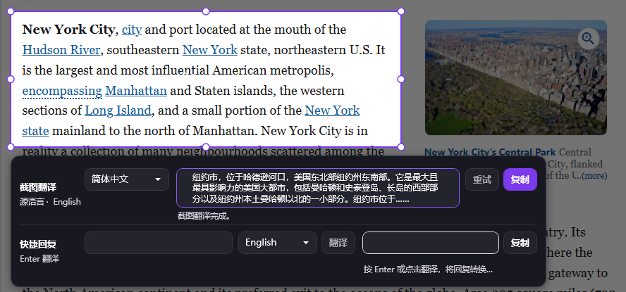
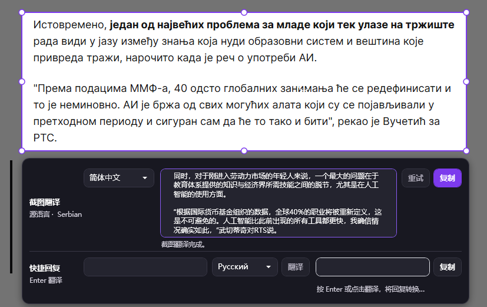

# Screenshot Translation

[简体中文](README.md) | **English**

Screenshot Translation is a Windows tray utility for translating game chat directly from a screen selection. Press a global shortcut, select text on a frozen image of the display under the cursor, and send that selection to an OpenAI-compatible multimodal model. The same overlay can translate a short reply back into the detected source language.

## Download the latest release

[**Download Screenshot Translation 1.0.8 (Windows x64 MSI)**](https://github.com/SOIL1900/screenshot-translation/releases/latest/download/ScreenshotTranslation.Installer.msi)

The installer supports Windows 10/11 x64. Previous versions and release notes are available on [GitHub Releases](https://github.com/SOIL1900/screenshot-translation/releases).

## Screenshots

Translating an English web page:



Translating Serbian text with automatic source-language detection:



## Supported environment

- Windows 10 or Windows 11 on x64 hardware.
- Normal windowed applications and borderless-windowed games.
- Exclusive fullscreen is not supported or guaranteed. Switch the game to windowed or borderless-windowed mode before capturing.
- One display per capture. Cross-display selections are not supported.
- An OpenAI-compatible multimodal endpoint and API key are required; the default preset targets Alibaba Cloud Bailian/DashScope.

## Installation

Use the MSI download link above and run the installer. The MSI installs the self-contained application under `Program Files\ScreenshotTranslation`, adds a Start Menu shortcut, and registers a standard Windows uninstall entry. It does not launch the application automatically and does not install an automatic updater.

Release builds are currently unsigned. Windows SmartScreen may show an "unrecognized app" warning. Check that the MSI came from this project's Release page before choosing **More info** and **Run anyway**. Signing can be added in a future release; bypassing this warning does not require an API key or any other secret.

On first launch, complete the model settings. Later launches remain in the system tray when configuration is complete. Starting the executable again activates the existing instance instead of creating a second tray process.

## Tray and capture workflow

- Left-click the tray icon to open Settings.
- Right-click for exactly three actions: **开始截图翻译** (Start screenshot translation), **设置** (Settings), and **退出** (Exit).
- Closing Settings hides it; choose **退出** to terminate the application.
- The default global capture shortcut is `Ctrl + Alt + D`. It can be changed under General settings.

To translate a screenshot:

1. Put the target application in normal windowed or borderless-windowed mode and move the cursor to the relevant display.
2. Press `Ctrl + Alt + D`, or choose **开始截图翻译** from the tray menu. The application captures that display once and presents the immutable frame as a frozen overlay.
3. Drag to create a selection. Move it by dragging inside, or resize it with any of the eight edge and corner handles. Translation requests are submitted on release, not continuously while dragging.
4. Review the detected source language and screenshot translation. You can change the screenshot target language and retry recoverable errors without leaving the overlay.
5. Enter a quick reply and translate it. The reply target defaults to the source language detected from the screenshot and can be changed. If a fallback response has no reliable language metadata, you must select the reply language manually.
6. Copy either translation. A successful copy closes the overlay and restores the window that was active before capture so the text can be pasted manually.

Press `Esc`, right-click before creating a valid selection, or click outside the selection and result panel to cancel. The application never injects text into a game.

## Model configuration

The application maintains one current OpenAI-compatible model configuration. Every field is visible and editable in Settings:

| Field | Default | Purpose |
| --- | --- | --- |
| API service URL | `https://dashscope.aliyuncs.com/compatible-mode/v1` | Base URL for the OpenAI-compatible endpoint. |
| API Key | Empty | Credential sent to the configured endpoint. |
| Model name | `qwen3.7-flash` | Multimodal model used for screenshots and replies. |
| Thinking mode | Off (`enable_thinking: false`) | Enables or disables model thinking in requests. |
| Temperature | `0.2` | Translation randomness. |
| Maximum output tokens | `2048` | Maximum generated response length. |
| Request timeout | `30` seconds | Per-request timeout. |
| Extra request parameters JSON | `{}` | Additional provider-compatible request properties. |

The exact default model is `qwen3.7-flash`, and requests default to `enable_thinking: false`. The **测试连接** (Test connection) action sends a small real request to validate the URL, key, model permission, and response shape; the provider may charge for that request.

Before upload, a selected PNG is normalized to a maximum 2048-pixel long edge and an 8 MiB encoded-PNG payload. Smaller PNGs are not upscaled; oversized images are resized proportionally and remain PNG. Normalization runs in a cancelable background task so it does not block the overlay.

## Privacy and local data

Settings are stored at `%APPDATA%\ScreenshotTranslator\settings.json`. The API key is stored there in plaintext and remains visible in the normal Settings text box. The application does not use Windows Credential Manager, so protect the Windows account and this file accordingly. Do not commit a populated settings file or paste its contents into an Issue.

The application has no telemetry and stores no translation history. It does not persist screenshots, quick-reply text, complete model requests, complete responses, or translations to disk or diagnostic logs. The selected screenshot crop and reply text are still sent over the network to the endpoint you configure; review that provider's privacy and retention terms.

## Build, test, and package

Building from source requires Windows x64, the .NET 8 SDK, and network access to restore NuGet packages, including the WiX Toolset SDK.

```powershell
dotnet restore ScreenshotTranslation.sln
dotnet build ScreenshotTranslation.sln -c Release --no-restore
dotnet test ScreenshotTranslation.sln -c Release --no-build
```

Create the self-contained Windows x64 publish directory and MSI:

```powershell
dotnet publish src/ScreenshotTranslation.App/ScreenshotTranslation.App.csproj -c Release -r win-x64 --self-contained true -o artifacts/publish
dotnet build installer/ScreenshotTranslation.Installer.wixproj -c Release
```

The first command writes the portable release payload to `artifacts\publish`. The second packages that exact directory into an x64 MSI. Neither command needs an API key. The Windows GitHub Actions workflow performs restore, Release build, automated tests, self-contained publish, and MSI packaging without repository secrets or live API calls.

## Contributing

Issues and focused pull requests are welcome. Please:

1. Keep Core logic independent of WPF and Win32 adapters, and keep network/screen behavior injectable for tests.
2. Add or update focused automated coverage for changed behavior, then run the risk-proportionate build and test commands instead of repeating full verification without a reason.
3. Never commit API keys, populated settings files, screenshots, translations, or other private user data.

This project is available under the [MIT License](LICENSE).
